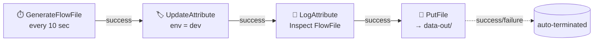
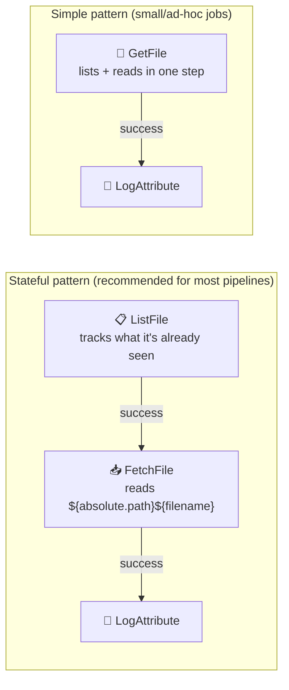

# 🖥️ Section 3 — Building Your First Flows (UI Fundamentals)

Two working flows, built and verified against the NiFi instance from
[Section 2](../02-setup/), exported as reusable templates in
[`flow-templates/`](flow-templates/).

---

## 1. 🧩 Flow A — Generate → Update → Log → Put (the core exercise)



| Processor | Role | Key config |
|---|---|---|
| `GenerateFlowFile` | Produces a test FlowFile on a schedule | `schedulingPeriod = 10 sec` |
| `UpdateAttribute` | Adds a custom attribute | dynamic property `env = dev` |
| `LogAttribute` | Prints FlowFile attributes to `logs/nifi-app.log` for inspection | defaults (logs all attributes) |
| `PutFile` | Writes the FlowFile content to a local directory | `Directory = /opt/nifi/nifi-current/data-out`, `Conflict Resolution Strategy = replace` |

Import: [`flow-templates/03-generate-update-log-put.json`](flow-templates/03-generate-update-log-put.json)
(download a JSON flow definition via a Process Group's **⋮ → Download flow definition**, and
import it the same way via **Upload** on the canvas).

### Relationships & termination
- Every processor above has exactly one outgoing relationship (`success`) — each is wired to
  the next processor in the chain.
- `PutFile` is the end of the chain, so both its `success` and `failure` relationships are
  **auto-terminated** (checked in the processor's Settings tab) rather than routed anywhere.
  A processor **cannot start** if it has an unhandled relationship that's neither connected
  nor auto-terminated — NiFi's validation will block it.

---

## 2. ✅ Practical exercise — verified end-to-end

**Goal:** generate a file every 10s, tag it `env=dev`, write it locally, confirm in Data Provenance.

1. Built the flow above via the NiFi REST API (same result as building it by hand in the UI).
2. Started the process group and watched `data-out/` on the host fill up with a new file
   roughly every 10 seconds (mounted from the container via a bind mount — see
   [`02-setup/docker-compose.yml`](../02-setup/docker-compose.yml)).
3. Confirmed the attribute was actually applied by querying **Data Provenance** through the
   REST API (`POST /nifi-api/provenance`, scoped to the UpdateAttribute processor):
   ```json
   {
     "eventType": "ATTRIBUTES_MODIFIED",
     "componentName": "Add env=dev Attribute",
     "attributes": [{ "name": "env", "value": "dev" }]
   }
   ```
   In the UI this is the same thing you'd see under **☰ → Data Provenance**, searching by
   component name, then opening an event's **Attributes** tab.
4. Confirmed `LogAttribute` fired for every FlowFile (checked `logs/nifi-app.log` inside the
   container — one line per FlowFile, e.g. `logging for flow file ... name=abb95661-...`).
5. Stopped the process group afterward (a learning sandbox doesn't need to run 24/7).

> 💡 In the real UI: right-click a FlowFile in a connection's queue → **List Queue** →
> click a FlowFile → **Provenance** icon. That's the same lineage view, just reached by
> clicking instead of calling the REST API directly.

---

## 3. 📂 Flow B — Reading local files (`ListFile`+`FetchFile` vs `GetFile`)

The topic list also calls out `GetFile` and `ListFile`+`FetchFile` for **reading** files.
Built a second process group to compare them side by side, reading from
[`data-in/`](data-in/) (seeded with two sample JSON files).



Import: [`flow-templates/03b-reading-local-files-demo.json`](flow-templates/03b-reading-local-files-demo.json)

### ⚠️ Real gotcha hit while testing this

`GetFile` and `ListFile` are **not interchangeable** — this became obvious the moment both
ran against the same two files:

| | `ListFile` → `FetchFile` | `GetFile` (with `Keep Source File = true`) |
|---|---|---|
| State tracking | ✅ Persists a "last seen" cursor — won't re-list unchanged files | ❌ None — every scheduled run re-scans the whole directory |
| Result in this test (8 seconds, default `0 sec` scheduling) | **10** log lines total (briefly re-settled, then stopped re-listing) | **15,070** log lines — it re-ingested the same 2 files continuously |
| Why `GetFile` defaults to *deleting* source files | Without deletion (or state), there's nothing to stop it from re-reading forever — deletion is its only built-in way to avoid reprocessing |
| When to use | Directories that grow over time / need incremental, restart-safe ingestion | Simple one-off or "drain and delete" ingestion of a small local folder |

✅ Fix applied: set `GetFile`'s `schedulingPeriod` to `30 sec` before leaving it stopped, so
it can't be accidentally started at the runaway default (`0 sec` = "as fast as possible").

**Takeaway:** `ListFile`+`FetchFile` separates *what to read* (tracked, stateful) from
*how to read it* (stateless fetch) — prefer this pair for anything beyond a quick demo.
`GetFile` is simplest when you genuinely want to drain a folder once and don't need history.

---

## 4. 🖥️ UI concepts this section covers (reference)

| Concept | Where in the UI |
|---|---|
| Adding a processor | Drag the ⚙️ icon from the top toolbar onto the canvas, pick a type, search e.g. "PutFile" |
| Configuring a processor | Double-click it, or right-click → **Configure** → **Properties** tab |
| Connections | Drag from one processor's edge to another; a dialog lets you pick which relationship(s) to route |
| Auto-terminate vs route | Processor **Settings** tab → checkboxes next to each relationship not otherwise connected |
| Starting/stopping | Select component(s) → ▶️/⏹️ in the **Operate** palette, or right-click → Start/Stop |
| Viewing FlowFile content | Right-click a connection → **List Queue** → click a FlowFile → **View** |
| Data Provenance | ☰ (top-right global menu) → **Data Provenance** → search by component/attribute |

---

## 🔁 Reproduce this yourself in the UI

1. `cd 02-setup && docker compose up -d`, log in at `https://localhost:8443/nifi`.
2. On the canvas, drag on the 4 processors from Flow A, configure each per the table above.
3. Wire them with `success` connections; on `PutFile`'s Settings tab, check both
   relationship boxes to auto-terminate.
4. Start the process group (▶️ on the canvas, or select all + Start in the Operate palette).
5. Watch `03-first-flows/data-out/` on your host fill up, and confirm attributes via
   **Data Provenance**.
6. Repeat for Flow B using [`data-in/`](data-in/) as the source directory, and watch
   `logs/nifi-app.log` to see the ListFile/GetFile difference for yourself.
