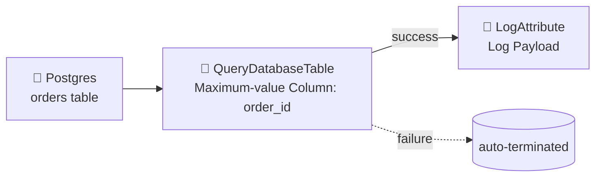
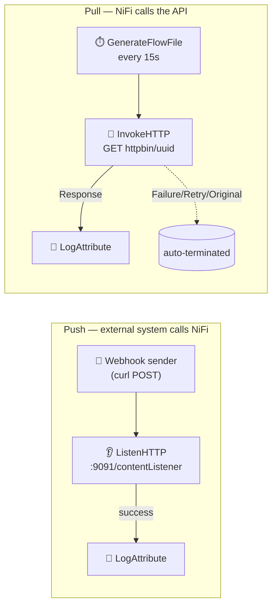
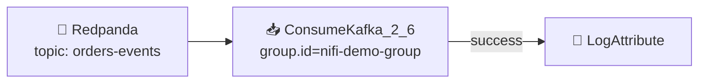

# 📥 Section 4 — Data Ingestion (Sources)

Four ingestion patterns built and verified end-to-end against real (containerized) sources:
a relational database, a webhook-style push, a polled REST API, and — if the broker pulled
successfully — Kafka. Filesystem ingestion (`ListFile`/`FetchFile`, `GetFile`) was already
covered hands-on in [Section 3](../03-first-flows/notes.md#3--flow-b--reading-local-files-listfilefetchfile-vs-getfile).

---

## 1. 🗄️ Relational DB — `QueryDatabaseTable` (the core exercise)



| Component | Config |
|---|---|
| `postgres` service | Seeded via [`db/init.sql`](db/init.sql) — an `orders` table with 3 starter rows |
| `DBCPConnectionPool` (controller service) | `jdbc:postgresql://postgres:5432/sourcedb`, driver jar at `/opt/nifi/nifi-current/drivers/postgresql-42.7.4.jar` (see [`drivers/download.sh`](drivers/download.sh) — the jar itself is gitignored) |
| `QueryDatabaseTable` | `Table Name = orders`, `Maximum-value Columns = order_id`, runs every 15s |
| `LogAttribute` | `Log Payload = true`, so the fetched Avro records are visible in `logs/nifi-app.log` |

Import: [`flow-templates/04a-db-ingestion-querydatabasetable.json`](flow-templates/04a-db-ingestion-querydatabasetable.json)
(sensitive properties like the DB password are never exported in plaintext — re-enter them
after import).

### ✅ Practical exercise — verified incremental behavior

1. Started the flow against the 3 seed rows → **first run pulled exactly 3 rows**
   (`querydbtable.row.count = 3`, `maxvalue.order_id = 3`).
2. Waited a full second scheduling cycle with **no new data** → **zero new FlowFiles**
   (state persisted in NiFi's component state, not re-scanning from scratch).
3. Inserted 2 new rows directly into Postgres:
   ```sql
   INSERT INTO orders (customer, item, amount) VALUES
     ('Dana', 'Doohickey', 15.00), ('Evan', 'Thingamajig', 22.25);
   ```
4. Next cycle → **exactly 2 new FlowFiles** worth of data
   (`querydbtable.row.count = 2`, `maxvalue.order_id` advanced `3 → 5`) — the 3 original
   rows were **not** re-ingested.

This is the "maximum-value column" incremental strategy: NiFi remembers the highest value
it has seen for `order_id` and only asks the database for rows above that watermark on
each run — no timestamps, offsets, or manual bookkeeping required.

> 💡 `GenerateTableFetch` is the sibling processor for this pattern when you want NiFi to
> *generate SQL* (e.g. to fan out across a cluster) rather than run the query itself —
> useful for very large tables. `ExecuteSQL` is the tool for one-off/parameterized queries
> that aren't a full-table incremental pull.

---

## 2. 🌐 REST APIs — push (`ListenHTTP`) vs pull (`InvokeHTTP`)

Two directions, both real ingestion patterns for REST-based sources:



| Processor | Role | Key config |
|---|---|---|
| `ListenHTTP` | Receives pushed events (webhooks) | `Listening Port = 9091`, exposed on the host via `LISTENHTTP_PORT` |
| `InvokeHTTP` | Polls a REST endpoint on a schedule | `Remote URL = http://httpbin:80/uuid`, triggered by an upstream `GenerateFlowFile` every 15s |

Import: [`flow-templates/04b-rest-ingestion-listenhttp.json`](flow-templates/04b-rest-ingestion-listenhttp.json),
[`flow-templates/04c-rest-ingestion-invokehttp.json`](flow-templates/04c-rest-ingestion-invokehttp.json)

`httpbin` is an optional service (`docker compose --profile http up -d`) — a tiny HTTP
test target so `InvokeHTTP` has something real to poll without depending on the internet.

### ✅ Verified

- **ListenHTTP:** `curl -X POST http://localhost:9091/contentListener -d '{"event":"order.created","order_id":42}'`
  → `LogAttribute` showed the exact JSON payload land as the FlowFile content.
- **InvokeHTTP:** polled `httpbin:80/uuid` every 15s for ~1 minute → 4 responses, each with
  `invokehttp.status.code = 200` and a distinct `uuid` value in the body — confirming it's
  a live poll, not a cached response.

### ⚠️ Relationship gotcha hit while building this

`InvokeHTTP` has **four** relationships (`Response`, `Original`, `Retry`, `No Retry`/`Failure`
depending on version). It's easy to wire up `Response` and forget the rest — the processor
won't start until every relationship is either connected or explicitly auto-terminated.
NiFi's validation error was specific and immediate: `'Relationship Original' is invalid
because Relationship 'Original' is not connected to any component and is not auto-terminated`.

---

## 3. 📨 Kafka / Messaging — `ConsumeKafka`



Kafka itself isn't run here — [Redpanda](https://redpanda.com/) is used instead, a
single-binary broker that speaks the Kafka wire protocol, so `ConsumeKafka` (and later
`PublishKafka`) work against it exactly as they would against real Kafka, without needing
a separate ZooKeeper/KRaft cluster for a learning environment. Optional service:
`docker compose --profile kafka up -d`.

| Component | Config |
|---|---|
| `redpanda` service | Kafka-compatible broker, reachable by NiFi at `redpanda:9092` |
| `ConsumeKafka_2_6` | `bootstrap.servers = redpanda:9092`, `topic = orders-events`, `group.id = nifi-demo-group`, `auto.offset.reset = earliest` |
| `LogAttribute` | `Log Payload = true` to see each consumed message |

Import: [`flow-templates/04d-kafka-ingestion-consumekafka.json`](flow-templates/04d-kafka-ingestion-consumekafka.json)

### ✅ Verified

1. Created a topic and produced 3 JSON messages via Redpanda's CLI (`rpk topic produce`).
2. `ConsumeKafka` picked up **all 3** within seconds, content intact
   (`order.created`/`order.shipped` events with their `order_id`s all visible in the logs).
3. **Stopped and restarted** the processor, then waited — **no re-consumption**. The
   consumer group (`nifi-demo-group`) had already committed its offset to Redpanda, so
   NiFi picked up exactly where it left off instead of replaying from the beginning.

This offset-commit behavior is the Kafka equivalent of `QueryDatabaseTable`'s
maximum-value column above — a different mechanism (broker-tracked offsets vs.
NiFi-tracked state), same underlying goal: **never process the same input twice**.

---

## 4. 📚 Covered by reference only (not hands-on in this local environment)

These need infrastructure this repo intentionally doesn't stand up locally (cloud accounts,
binlog replication setup) — documented here so the processor names are known when the need
arises for real:

| Source Type | Processors | Why not hands-on here |
|---|---|---|
| ☁️ Cloud storage | `ListS3`/`FetchS3Object`, `ListAzureBlobStorage` | Requires real (or emulated, e.g. LocalStack/Azurite) cloud credentials — same `List`+`Fetch` stateful pattern already proven with `ListFile`+`FetchFile` in Section 3 |
| 🪟 Change Data Capture | `CaptureChangeMySQL` | Requires MySQL configured with binlog replication enabled (`log-bin`, `binlog_format=ROW`) — a heavier one-off setup better suited to its own dedicated walkthrough |

`QueryDatabaseTable`'s incremental-column strategy (proven above) is the simpler alternative
to full CDC when the source table has a reliably increasing key/timestamp column and
near-real-time (rather than millisecond) latency is acceptable.

---

## 🔁 Reproduce this yourself

```bash
04-data-ingestion/drivers/download.sh     # fetch the Postgres JDBC driver (gitignored jar)

cd 02-setup
docker compose up -d                      # nifi + postgres (core services)
docker compose --profile http up -d       # + httpbin, for InvokeHTTP
docker compose --profile kafka up -d      # + redpanda, for ConsumeKafka
```

Then import the templates from `04-data-ingestion/flow-templates/` (canvas → **Upload**),
or build them by hand in the UI following the tables above.
