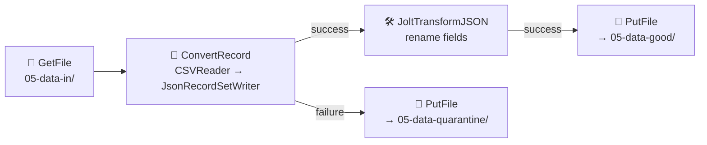
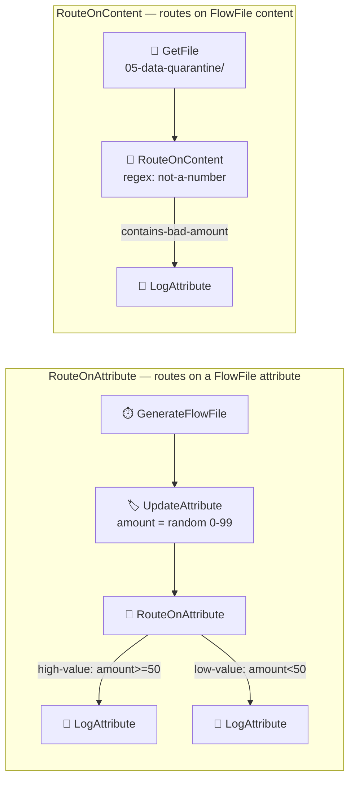
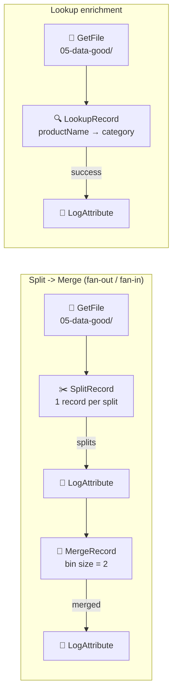
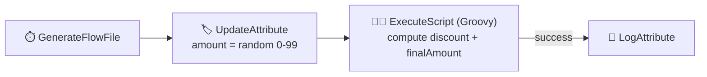

# 🔄 Section 5 — Data Transformation & Routing

Four flows, all built and verified end-to-end against the running NiFi instance, covering
every topic in the roadmap table: content-based routing, record-oriented processing,
JSON transformation, schema management, splitting/merging, lookups/enrichment, and
custom logic via scripting.

---

## 1. 🧩 Flow A — CSV → JSON with Jolt + Quarantine (the core exercise)



| Component | Config |
|---|---|
| `AvroSchemaRegistry` (controller service) | Holds the `orders` schema centrally — the **schema management** topic. Both the CSV reader and JSON writer reference it instead of duplicating schema text. |
| `CSVReader` | `Schema Access Strategy = schema-name` → `orders` (from the registry), `Treat First Line as Header = true` |
| `JsonRecordSetWriter` | `Schema Access Strategy = inherit-record-schema` (just reuses whatever schema the reader validated against) |
| `ConvertRecord` | The **record-oriented processing** workhorse — reads CSV, validates against the Avro schema, writes JSON |
| `JoltTransformJSON` | Shift spec renaming `order_id→orderId`, `customer→customerName`, `item→productName`, `amount→totalAmount`, `order_date→orderDate` |
| `PutFile` ×2 | One for `success` (good), one for `failure` (quarantine) |

Import: [`flow-templates/05a-csv-to-json-jolt-quarantine.json`](flow-templates/05a-csv-to-json-jolt-quarantine.json)

### ✅ Practical exercise — verified

Two input files in [`data-in/`](data-in/):
- `valid-orders.csv` — 2 well-formed rows
- `invalid-orders.csv` — 1 row with `amount = "not-a-number"` (violates the `double` type in the schema)

Result after running the flow:

| File | Routed to | Content |
|---|---|---|
| `valid-orders.csv` | `data-good/` | `[{"orderId":1,"customerName":"Alice","productName":"Widget","totalAmount":19.99,...}, ...]` — fields renamed exactly per the Jolt spec |
| `invalid-orders.csv` | `data-quarantine/` | Untouched raw CSV — never even reached the Jolt step |

The log confirmed the exact reason: `ConvertRecord ... Failed to process ... will route to
failure` — schema validation happens **before** any transformation, so bad records are
caught at the earliest possible point and never pollute the good-data path.

> 💡 `ConvertRecord`'s failure relationship is *all-or-nothing per FlowFile* — if a file has
> mixed good/bad rows, the whole file goes to quarantine. For true per-row quarantining
> within a single file, you'd pre-split with `SplitRecord` first (see Flow C below) so each
> row is its own FlowFile, then each one succeeds or fails independently.

### ⚠️ Gotcha hit while building this

The Jolt spec format depends on the selected **Jolt Transformation DSL**. For `jolt-transform-shift`,
the `jolt-spec` property must be the bare shift spec object — wrapping it in the usual
Jolt "chainr" array (`[{"operation":"shift","spec":{...}}]`) fails validation with
`Shiftr expected a spec of Map type, got ArrayList`. The chainr wrapper is only needed for
`jolt-transform-chain` (multiple chained operations).

---

## 2. 🔀 Flow B — Content-Based Routing (`RouteOnAttribute` + `RouteOnContent`)



`RouteOnAttribute` and `RouteOnContent` both work by adding **dynamic properties** — each
property name becomes a relationship, and its value is the matching rule (NiFi Expression
Language for attributes, a regex for content).

Import: [`flow-templates/05b-content-based-routing.json`](flow-templates/05b-content-based-routing.json)

### ✅ Verified
- Over several `GenerateFlowFile` cycles, amounts routed correctly: e.g. `76 → high-value`,
  values under 50 → `low-value` (1 high / 5 low observed in one run — consistent with a
  uniform 0–99 distribution over few samples).
- `RouteOnContent` picked up `invalid-orders.csv` (still sitting in quarantine from Flow A)
  and matched it to the `contains-bad-amount` relationship via its regex.

### ⚠️ Gotcha hit while building this
`RouteOnContent`'s **Match Requirement** defaults to `content must match exactly` — meaning
the *entire* FlowFile content must equal the pattern, not just contain it. A regex like
`not-a-number` will never match a multi-line CSV file under that mode. Switching to
`content must contain match` fixed it immediately.

---

## 3. ✂️ Flow C — Split, Merge, and Lookup Enrichment



| Component | Config |
|---|---|
| `SplitRecord` | `Records Per Split = 1` — turns a 2-record JSON array into 2 single-record FlowFiles |
| `MergeRecord` | `Minimum/Maximum Number of Records = 2` — re-bins matching FlowFiles back into one array |
| `SimpleKeyValueLookupService` | A hardcoded map: `Widget→Hardware`, `Gadget→Electronics`, `Gizmo→Electronics` |
| `LookupRecord` | Dynamic property `key = /productName` (the RecordPath used as the lookup coordinate — the property *name* must match what the LookupService requires, here literally `key`), `Result RecordPath = /category` |

Import: [`flow-templates/05c-split-merge-lookup-enrichment.json`](flow-templates/05c-split-merge-lookup-enrichment.json)

### ✅ Verified
- **Split:** a 2-record file produced exactly 2 single-record FlowFiles.
- **Merge:** those split FlowFiles were re-binned back into batches with `record.count = 2`
  — fan-out and fan-in confirmed round-trip correctly.
- **Lookup enrichment:** actual output content showed
  `"category": "Hardware"` for the Widget order and `"category": "Electronics"` for the
  Gadget order — the enrichment field was correctly inserted per-record.

### ⚠️ Gotcha hit while building this
`LookupRecord` doesn't have a fixed "lookup key" property in its descriptor list — the
correct dynamic property *name* is dictated by the chosen `LookupService` (for
`SimpleKeyValueLookupService` it's literally `key`), and its *value* is a RecordPath
pointing at the field to look up. Easy to miss since it's not documented as a standard
property in the UI's property table the way `result-record-path` is — you only find it in
the LookupService's own documentation.

---

## 4. 🧑‍💻 Flow D — Custom Logic (`ExecuteScript`)



For logic that no declarative processor covers — here, a tiered discount calculation —
`ExecuteScript` runs an inline Groovy script directly against the NiFi Process
Session API:
```groovy
def flowFile = session.get()
if (!flowFile) return
def amount = (flowFile.getAttribute("amount") ?: "0") as Double
def discount = amount >= 50 ? 0.10 : 0.0
def finalAmount = amount - (amount * discount)
flowFile = session.putAttribute(flowFile, "discount", discount.toString())
flowFile = session.putAttribute(flowFile, "finalAmount", finalAmount.toString())
session.transfer(flowFile, REL_SUCCESS)
```

Import: [`flow-templates/05d-custom-logic-executescript.json`](flow-templates/05d-custom-logic-executescript.json)

### ✅ Verified
Real computed values from the log: `amount=81 → discount=0.10, finalAmount=72.9` and
`amount=37 → discount=0.0, finalAmount=37.0` — the 50-point threshold and the arithmetic
both check out.

> 💡 `ExecuteStreamCommand` is the sibling processor for when the "custom logic" already
> exists as an external executable/shell script rather than inline Groovy/Python/Jython —
> useful for wrapping existing CLI tools into a flow without rewriting them.

---

## 🔁 Reproduce this yourself

```bash
cd 02-setup
docker compose up -d
```

Then import each template from `05-transform-routing/flow-templates/` (canvas → **Upload**).
Flow A's controller services (`AvroSchemaRegistry`, `CSVReader`, `JsonRecordSetWriter`) and
Flow C's (`JsonTreeReader`, `JsonRecordSetWriter`, `SimpleKeyValueLookupService`) come in
disabled after import — enable them before starting the processors.
