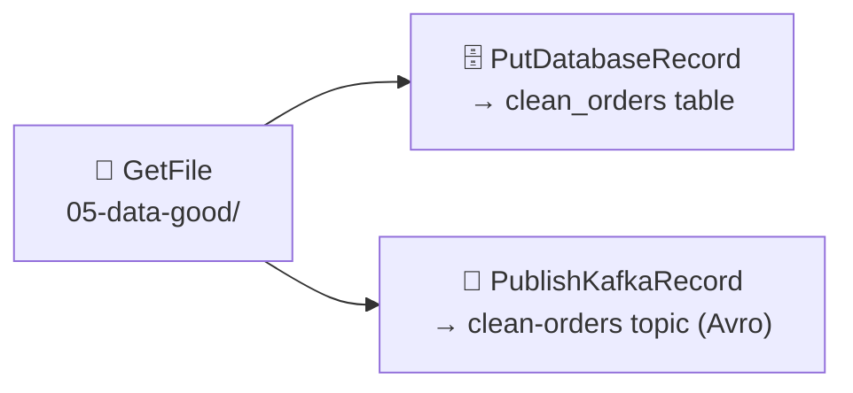
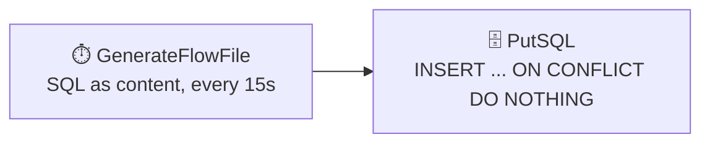
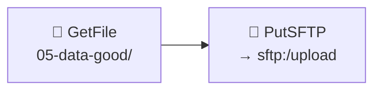
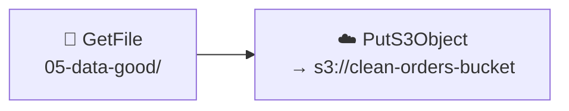

# 📤 Section 6 — Data Egress (Sinks & Delivery)

Four sink patterns built and verified end-to-end, all extending the "clean" JSON records
produced in [Section 5](../05-transform-routing/notes.md) (`05-transform-routing/data-good/valid-orders.csv`)
— the exact exercise the roadmap asks for, plus SFTP and S3 as additional real destinations.

---

## 1. 🗄️ Relational DB + 📨 Kafka — `PutDatabaseRecord` + `PublishKafkaRecord` (the core exercise)



| Component | Config |
|---|---|
| `JsonTreeReader` | `schema-access-strategy = infer-schema` — infers the record schema straight from the JSON |
| `DBCPConnectionPool` | Same Postgres instance as Section 4, driver at `/opt/nifi/nifi-current/drivers/postgresql-42.7.4.jar` |
| `clean_orders` table | See [`db/clean_orders.sql`](db/clean_orders.sql) — `order_id` is a `PRIMARY KEY` (this matters, see below) |
| `PutDatabaseRecord` | `Statement Type = INSERT`, `Table Name = clean_orders`, `Translate Field Names = true` |
| `AvroRecordSetWriter` | `schema-access-strategy = inherit-record-schema` |
| `PublishKafkaRecord_2_6` | `bootstrap.servers = redpanda:9092`, `topic = clean-orders` |

Import: [`flow-templates/06a-db-kafka-egress.json`](flow-templates/06a-db-kafka-egress.json)

### ✅ Verified

- First run: **2 rows** landed in Postgres (`SELECT * FROM clean_orders` showed Alice/Widget,
  Bob/Gadget with columns correctly translated `orderId → order_id`, `customerName →
  customer_name`, etc. — `Translate Field Names` normalizes both sides by stripping
  non-alphanumerics and case, so camelCase JSON matches snake_case SQL automatically).
- Same run: **2 Avro records** landed in the `clean-orders` Kafka topic, each with the
  embedded Avro schema (`orderId`, `customerName`, `productName`, `totalAmount`, `orderDate`)
  visible via `rpk topic consume`.

### 💥 Then it broke — on purpose (the idempotency lesson)

`GetFile` here uses `Keep Source File = true` (same non-destructive pattern as earlier
sections), so it re-reads `valid-orders.csv` on every scheduled run. Left running:

- **Postgres refused every repeat:**
  ```
  java.sql.BatchUpdateException: ... duplicate key value violates unique constraint
  "clean_orders_pkey" Detail: Key (order_id)=(1) already exists.
  ```
  `clean_orders` stayed at exactly **2 rows** no matter how many times the flow re-ran —
  the primary key did its job.
- **Kafka accepted every repeat.** After ~8 re-ingestion cycles, `rpk topic describe
  clean-orders` showed a high-watermark of **16** (8 cycles × 2 records) — Kafka has no
  concept of "this record already exists" at the topic level, so it just appended all of them.

This is the practical version of the roadmap's "exactly-once/idempotency considerations"
row: **the destination's own constraints determine whether at-least-once delivery becomes
exactly-once in effect.** A relational table with a primary key naturally de-duplicates;
an append-only log like Kafka does not — dedup there has to happen downstream (compacted
topics, consumer-side dedup, or not re-publishing in the first place).

---

## 2. ✅ Fixing it — `PutSQL` with an idempotent upsert



Same destination, same repeated-execution scenario — but this time the SQL itself is
written to tolerate re-runs:
```sql
INSERT INTO clean_orders (order_id, customer_name, product_name, total_amount, order_date)
VALUES (1, 'Alice', 'Widget', 19.99, '2026-01-05')
ON CONFLICT (order_id) DO NOTHING;
```

Import: [`flow-templates/06b-putsql-idempotent-upsert.json`](flow-templates/06b-putsql-idempotent-upsert.json)

### ✅ Verified

Ran on a 15-second schedule for over 30 seconds (multiple cycles) — **zero errors**, row
count stayed at 2 the entire time. Compare directly to the `PutDatabaseRecord` result above:
same table, same repeated input, but no failure this time — because the statement itself
is idempotent rather than relying on the destination to reject duplicates.

> 💡 `PutDatabaseRecord`'s `Statement Type` also supports `UPSERT`, which does this same
> thing generically (no hand-written SQL) if your database/driver combination supports it —
> `PutSQL` was used here mainly to make the SQL, and therefore the fix, fully visible.

---

## 3. 📁 Filesystem — `PutSFTP`



A real SFTP server ([`atmoz/sftp`](https://github.com/atmoz/sftp), optional —
`docker compose --profile sftp up -d`), not a mocked transport. Uploaded files land in
[`data-out-sftp/`](data-out-sftp/) on the host via a bind mount into the SFTP container's
`upload` directory.

Import: [`flow-templates/06c-putsftp-egress.json`](flow-templates/06c-putsftp-egress.json)

### ✅ Verified

`valid-orders.csv` (208 bytes, same renamed JSON content from Section 5) appeared in
`data-out-sftp/` within one scheduling cycle, transferred over the real SFTP/SSH protocol
(`Strict Host Key Checking = false` since it's a throwaway local key, not because SFTP host
verification doesn't matter in production — it very much does there).

---

## 4. ☁️ Object Storage — `PutS3Object` (via LocalStack)



Real AWS S3 API calls, but against [LocalStack](https://www.localstack.cloud/) (optional —
`docker compose --profile s3 up -d`) instead of an actual AWS account — no credentials or
billing needed for the hands-on exercise, and the exact same processor/config works against
real AWS by dropping the `Endpoint Override URL` and using real credentials.

| Setting | Value | Why |
|---|---|---|
| `AWS Credentials Provider service` | Access Key/Secret Key = `test`/`test` | LocalStack accepts any non-empty credentials |
| `Endpoint Override URL` | `http://localstack:4566` | Points the AWS SDK at LocalStack instead of `amazonaws.com` |
| `use-path-style-access` | `true` | LocalStack doesn't support virtual-hosted-style bucket DNS |

Import: [`flow-templates/06d-puts3object-localstack.json`](flow-templates/06d-puts3object-localstack.json)

### ✅ Verified

Created the bucket via `awslocal s3 mb s3://clean-orders-bucket`, ran the flow, then
confirmed with `awslocal s3 ls` / `awslocal s3 cp ... -` that `valid-orders.csv` (208 bytes,
same content) was really there — round-tripped through the actual S3 HTTP API, not just a
NiFi-side assumption that it worked.

---

## 5. 📚 Covered by reference only

| Destination | Processor | Why not hands-on here |
|---|---|---|
| 🔎 Search / analytics | `PutElasticsearchRecord` | Needs a full Elasticsearch node (heavier image, index/mapping setup) — the same `RecordReader → Put*` pattern already proven above (schema flows straight from the reader into the sink) carries over directly |
| ☁️ Azure Blob Storage | `PutAzureBlobStorage` | Same shape as `PutS3Object` above (list/put against object storage) — Azure's local emulator (Azurite) would be the equivalent of LocalStack here if hands-on Azure work comes up later |

---

## 🔁 Reproduce this yourself

```bash
cd 02-setup
docker compose up -d                  # nifi + postgres (core)
docker compose --profile kafka up -d  # + redpanda, for PublishKafkaRecord
docker compose --profile sftp up -d   # + sftp server, for PutSFTP
docker compose --profile s3 up -d     # + LocalStack, for PutS3Object

# apply the destination table once (docker-entrypoint-initdb.d only runs on first init)
docker exec -i nifi-postgres psql -U nifi -d sourcedb < ../06-data-egress/db/clean_orders.sql

# create the supporting topic/bucket
docker exec nifi-redpanda rpk topic create clean-orders
docker exec nifi-localstack awslocal s3 mb s3://clean-orders-bucket
```

Then import the templates from `06-data-egress/flow-templates/` (canvas → **Upload**).
