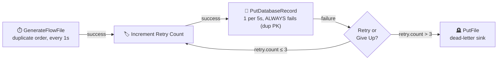
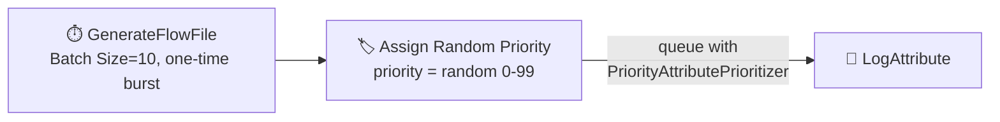
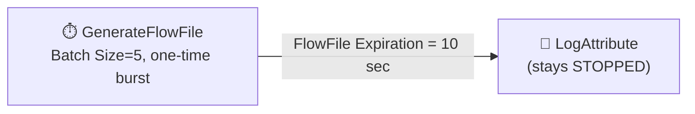

# ⚖️ Section 7 — Flow Control, Reliability & Performance

Three flows built and verified live, each isolating one reliability mechanism — and two of
them turned up real, non-obvious behavior worth documenting on their own.

---

## 1. ⏸️ Back-pressure + 🔁 Retry Loop + 🪦 Dead-Letter (the core exercise)



| Component | Config | Why |
|---|---|---|
| `GenerateFlowFile` | Content = a JSON order with `orderId: 1` — a row that **already exists** in `clean_orders` (from Section 6) | Guarantees a deterministic, reproducible failure — no flakiness |
| Connection: `UpdateAttribute → PutDatabaseRecord` | **Back-pressure Object Threshold = 5** | The actual bottleneck point — see below for why it's *not* the connection right after `GenerateFlowFile` |
| `UpdateAttribute` | `retry.count = ${retry.count:replaceNull(0):plus(1)}` | Increments on every pass through the loop; `replaceNull(0)` seeds it on the first attempt |
| `PutDatabaseRecord` | `Batch Size = 1`, 1 concurrent task, `schedulingPeriod = 5 sec`, `retry` relationship auto-terminated | Deliberately slow **and** deliberately always-failing (duplicate key) |
| `RouteOnAttribute` | `retry = ${retry.count:le(3)}`, `give-up = ${retry.count:gt(3)}` | Caps retries at 3 attempts before giving up |
| `PutFile` (dead-letter) | Writes to [`data-deadletter/`](data-deadletter/) | Where permanently-failed records go instead of disappearing |

Import: [`flow-templates/07a-backpressure-retry-deadletter.json`](flow-templates/07a-backpressure-retry-deadletter.json)

### ⚠️ Real mistake #1: back-pressure on the wrong connection

First attempt put the back-pressure threshold on `GenerateFlowFile → UpdateAttribute`. That
connection drains **instantly** (`UpdateAttribute` is nearly free), so it never fills up —
the actual queue that backs up is the one feeding the *slow* processor,
`UpdateAttribute → PutDatabaseRecord`. Back-pressure has to sit on the connection immediately
upstream of the actual bottleneck, not just "somewhere near the front."

### ⚠️ Real mistake #2: a runaway loop that dropped ~54,000 FlowFiles

With `PutDatabaseRecord`'s `Batch Size` left at its default (1000) and no concurrent-task
limit, a single 5-second `onTrigger` invocation pulled **every** FlowFile currently in the
queue — including ones the retry loop had *just* re-added milliseconds earlier via the
(effectively-instant) `UpdateAttribute`/`RouteOnAttribute` pair. That let one FlowFile churn
through dozens of retry attempts within a single invocation, and with `GenerateFlowFile`
still adding one new FlowFile per second on top, the queue reached **53,970** queued items
before being manually stopped and drained (`POST /flowfile-queues/{id}/drop-requests`).
No data was corrupted — Postgres's primary key held for every single attempt — but it's a
sharp reminder that **"deliberately slow" needs an explicit ceiling** (`Batch Size = 1`,
`concurrentlySchedulableTaskCount = 1`), not just a longer `schedulingPeriod`. A slow
*schedule* with an unbounded *batch* is not actually slow.

### ✅ Verified (after the fix)

Running for ~45s with the fix in place:

| Connection | Queued | Threshold |
|---|---|---|
| `GenerateFlowFile → UpdateAttribute` | 29 | 10,000 (no limit — upstream of the real bottleneck) |
| `UpdateAttribute → PutDatabaseRecord` | 32 | **5** ← *over* threshold, proving back-pressure was actively engaged and the queue was still bounded rather than runaway |
| `RouteOnAttribute → UpdateAttribute` (retry loop) | 4 | — |

One FlowFile made it all the way to the dead-letter sink with `retry.count = 4` (confirmed
via a Data Provenance query scoped to the `PutFile` processor) — original content intact,
exactly 3 retries attempted before giving up. `clean_orders` stayed at 2 rows the entire time.

---

## 2. 🔢 Prioritizers



Import: [`flow-templates/07b-prioritizers-demo.json`](flow-templates/07b-prioritizers-demo.json)

### ⚠️ Real gotcha: "priority" means *lowest number first*, not highest

Assumption going in: `PriorityAttributePrioritizer` would process the **highest** `priority`
value first (higher number = more important — the intuitive reading). Fired a burst of 10
FlowFiles with random `priority` attributes (0–99) and checked the actual processing order
via the `priority` value recorded in Data Provenance for each FlowFile UUID, cross-referenced
against the order `LogAttribute` logged them in:

```
3, 35, 45, 56, 58, 59, 65, 82, 91, 92   ← strictly ascending
```

**Lowest value went first.** `PriorityAttributePrioritizer` follows the "priority-1-ticket"
convention (like a support queue or Unix `nice`) — **smaller number = higher priority** —
not a "bigger number wins" scoreboard convention. Easy to get backwards, expensive to get
backwards in production (silently reversed processing order, no error, no warning).

> 💡 Also learned in passing: NiFi's Timer-Driven processors run their **first** `onTrigger`
> immediately upon starting, regardless of `schedulingPeriod` — the period only governs the
> gap *between* subsequent runs. Confirmed by `GenerateFlowFile`'s "one-time burst" pattern:
> `Batch Size = 10`, `schedulingPeriod = 60 sec`, started, then stopped ~2s later — one full
> batch of 10 had already fired before the stop took effect.

---

## 3. ⏰ FlowFile Expiration



Import: [`flow-templates/07c-flowfile-expiration.json`](flow-templates/07c-flowfile-expiration.json)

### ⚠️ Real finding: expiration is enforced lazily, not by a background sweep

First attempt: fired 5 FlowFiles into a connection with `FlowFile Expiration = 10 sec`,
polled the queue every 2 seconds with the downstream `LogAttribute` **left stopped** the
entire time. Expected the queued count to drop to 0 on its own around the 10-second mark.

**It stayed at 5 for the full 16-second poll.** NiFi does **not** proactively sweep queues
and drop expired FlowFiles on a timer — expiration is checked **only when something tries
to service the queue** (a processor attempting to pull from it, or an API call like listing
the queue). Starting `LogAttribute` *after* the FlowFiles were well past their 10-second
limit confirmed this: the queue instantly went to 0, `LogAttribute` logged **nothing** (its
total log count didn't change), and a Data Provenance search for `EventType=EXPIRE` showed
exactly 5 `EXPIRE` events — all timestamped **the moment `LogAttribute` started**, not when
the FlowFiles actually crossed the 10-second age threshold.

**Practical implication:** a queue feeding a processor that's stopped, disabled, or too
backed up to ever reach the head of the queue will hold "expired" data indefinitely — the
byte/object counts in the UI will look stale-but-present until something finally touches
that queue and triggers the cleanup.

---

## 4. 📚 Covered by reference only

| Topic | Why not hands-on here |
|---|---|
| ⚖️ Load balancing (round-robin / partition-by-attribute) | Requires a multi-node NiFi **cluster** to have any effect — this repo runs a single standalone instance. Hands-on in [Section 9 of the roadmap](../roadmap.md) once clustering is set up |
| 🧵 Concurrent tasks & scheduling (cron-driven) | Config knobs rather than a distinct flow — used directly above (`concurrentlySchedulableTaskCount = 1` was the actual fix for the runaway-loop mistake, and `schedulingPeriod` behavior was explored via the prioritizer demo) |

---

## 🔁 Reproduce this yourself

```bash
cd 02-setup && docker compose up -d   # nifi + postgres (clean_orders table from Section 6)
```

Import the templates from `07-reliability-performance/flow-templates/` (canvas → **Upload**).
For the retry/dead-letter flow, start the whole process group. For the prioritizer and
expiration demos, start `GenerateFlowFile` **alone** first, let its one-time burst fire, stop
it, *then* start the downstream processor separately — starting everything together races
the burst against the consumer and hides the effect you're trying to observe (a mistake made
twice while building this section, see above).
