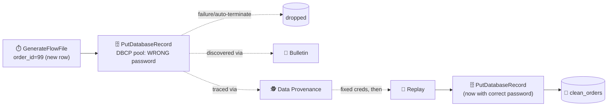

# 🕵️ Section 8 — Monitoring, Provenance & Troubleshooting

The core exercise (break → diagnose → fix → replay) verified end-to-end via the REST API,
plus real numbers pulled from the running instance for status history, bulletins, a live
Prometheus scrape, and both log files.

---

## 1. 🧯 The core exercise — break it, find it, fix it, replay it



Import: [`flow-templates/08a-break-diagnose-fix-replay.json`](flow-templates/08a-break-diagnose-fix-replay.json)

### ✅ Verified, step by step

1. **Broke it on purpose:** configured the `DBCPConnectionPool` controller service with an
   intentionally wrong password, then ran `GenerateFlowFile` once to push a new order
   (`order_id = 99`, a row that doesn't exist yet) through `PutDatabaseRecord`.
2. **Found the bulletin** via `GET /nifi-api/flow/bulletin-board?groupId={pgId}`:
   ```
   level: ERROR, source: "Write to Postgres (will fail: bad creds)"
   message: ... FATAL: password authentication failed for user "nifi"
   ```
   The exact same root cause is also visible directly on the FlowFile's own
   `putdatabaserecord.error` attribute — you don't strictly need the bulletin board if
   you're already looking at the FlowFile in Data Provenance.
3. **Traced it in Data Provenance:** searched by `ProcessorID`, found the FlowFile's
   `ATTRIBUTES_MODIFIED` event (its last live state before being dropped) and the
   subsequent `DROP` event (`"Auto-Terminated by failure Relationship"`). The event detail
   confirmed `"replayAvailable": true` — NiFi still has the original content in the
   Content Repository even though the FlowFile object itself is gone from any queue.
4. **Fixed it:** updating a controller service's properties requires it to be `DISABLED`
   first — and disabling it requires every processor that references it to be stopped
   first, not just the upstream generator. (First fix attempt silently no-opped because
   `PutDatabaseRecord` itself was still running — NiFi correctly refused to disable a
   service that's actively in use.) Stopped `PutDatabaseRecord`, disabled the service, set
   the correct password, re-enabled (`validationStatus` went from stuck `VALIDATING` to
   `VALID` — a useful tell that the earlier attempt hadn't really taken effect), restarted
   the processor.
5. **Replayed it:** `POST /nifi-api/provenance-events/replays` with `{"eventId": 34109}` —
   note the event ID goes in the request **body**, not the URL path
   (`/provenance-events/{id}/replay` doesn't exist; the real endpoint is
   `/provenance-events/replays`, found in the bundled REST API docs since it isn't obvious
   from the UI alone). The response is itself a new `REPLAY` provenance event, spawning a
   *new* FlowFile (fresh UUID) that's a child of the original.
6. **Confirmed the fix:** `SELECT * FROM clean_orders WHERE order_id=99` — Zoe/Sprocket,
   the exact original content, now actually in the database. No need to regenerate the
   input; the replay resubmitted the original bytes.

---

## 2. 📊 Status history & summary — real numbers, not hypothetical

`GET /nifi-api/system-diagnostics` (the same data behind the UI's Cluster/Node summary):

| Metric | Value |
|---|---|
| Used heap | 680.16 MB / 1,024 MB (66.0%) |
| Total threads | 85 |
| Available processors | 15 |
| FlowFile repo storage | 11.0% used |

Per-processor throughput via `GET /nifi-api/flow/processors/{id}/status/history`
(note: **not** `/nifi-api/processors/{id}/...` — status history lives under the `/flow`
namespace) — one real snapshot from `PutDatabaseRecord`:
```json
{ "inputCount": 1, "inputBytes": 105, "taskCount": 1, "taskMillis": 25,
  "flowFilesRemoved": 1, "averageLineageDuration": 36 }
```
Every processor type exposes its own extra metrics here too — `PutDatabaseRecord`
specifically reports `"INSERT updates performed"` and `"Batches Executed"` alongside the
generic throughput counters.

---

## 3. 🪵 Logs — what actually lives where

| File | Contains | Real example seen while building this repo |
|---|---|---|
| `logs/nifi-app.log` | Everything at the NiFi-application level: processor errors, bulletins, repository checkpoints, controller service lifecycle | `Successfully checkpointed FlowFile Repository with 20 records in 0 milliseconds` |
| `logs/nifi-bootstrap.log` | JVM/launcher-level output *before* the application logging framework takes over — crashes here mean NiFi never even got to start | `WARNING: An illegal reflective access operation has occurred ... by jetbrains.exodus.io.FileDataWriter` (a JVM module-system warning from a bundled dependency, not a NiFi bug) |

**Rule of thumb:** if a processor is misbehaving, `nifi-app.log` has the answer (usually
right next to a bulletin). If NiFi itself won't start or the process dies unexpectedly,
`nifi-bootstrap.log` is where the JVM-level reason shows up first.

---

## 4. 📈 Reporting Tasks — `PrometheusReportingTask`

```bash
curl -sL http://localhost:9093/metrics
```

Added the built-in `PrometheusReportingTask`, port `9093` (exposed via
[`docker-compose.yml`](../02-setup/docker-compose.yml)), `All Components` strategy, JVM
metrics enabled. Started it and scraped the endpoint for real.

### ✅ Verified

- **1,781 lines**, **41 distinct metric types**, covering every processor and connection
  across the *entire* instance (every section's flows in this repo showed up — proof it's
  a live introspection of the running flow, not a static/sample export).
- JVM metrics were genuinely live: `nifi_jvm_uptime 119.0`, `nifi_jvm_thread_count 92.0`,
  `nifi_jvm_gc_runs{gc_name="G1-Young-Generation"} 13.0`.
- Per-connection metrics like `nifi_backpressure_enabled` carry full label metadata
  (`source_name`, `destination_name`, `parent_id`) — enough to build a real Grafana
  dashboard without any extra NiFi-side configuration.

⚠️ **Gotcha:** the endpoint issues a `302` redirect from `/metrics` to `/metrics/` — plain
`curl` without `-L` (or a Prometheus scrape config with `follow_redirects: false`) will
silently get nothing back. Also, the default port (`9092`) collides with this repo's
Redpanda broker from Section 4 — reconfigured to `9093` here.

---

## 5. 🧯 Common failure patterns (reference)

| Pattern | What it looks like | Where you'd notice it |
|---|---|---|
| OOM from large content | `OutOfMemoryError` in `nifi-app.log`, often triggered by a processor that loads full FlowFile content into memory (e.g., certain script/record processors) on unexpectedly large files | App log + likely a crashed/unresponsive UI |
| Stuck queues | Queue count climbs and never drains; the feeding processor may show `Invalid` or simply never catches up | Canvas queue counts, or `status/history` showing `taskCount` flatlining while `inputCount` upstream keeps climbing — see Section 7's back-pressure/runaway-loop incident for a real example of this in practice |
| Misconfigured schedulers | A processor scheduled `0 sec` (as fast as possible) that should have been throttled — see Section 3's `GetFile` re-ingestion gotcha and Section 7's `PutDatabaseRecord` batch-size incident, both real instances of this exact pattern | Runaway throughput in `status/history`, exploding log volume |

---

## 🔁 Reproduce this yourself

```bash
cd 02-setup && docker compose up -d
```

Import [`flow-templates/08a-break-diagnose-fix-replay.json`](flow-templates/08a-break-diagnose-fix-replay.json),
set a wrong password on its `DBCPConnectionPool`, run `GenerateFlowFile` once, then work
through: **☰ → Bulletin Board** (or the API call above) → **☰ → Data Provenance** → fix the
password (stop the processor, disable the service, fix, re-enable, restart) → right-click
the provenance event → **Replay**.
