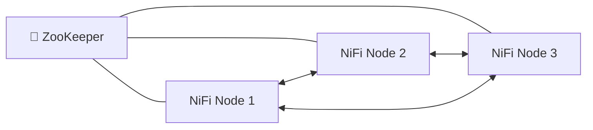
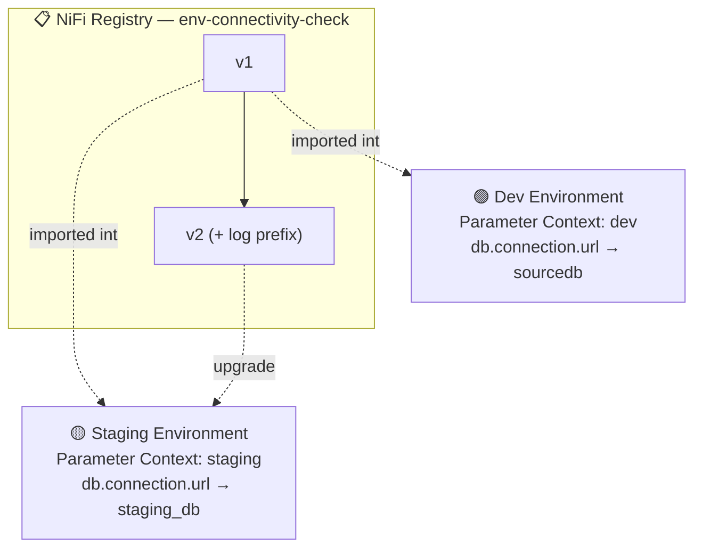

# 🖧 Section 9 — Clustering, Security & Governance

The full practical exercise — a 3-node cluster, NiFi Registry versioning, and Parameter
Contexts promoting the same flow between dev and staging — built and verified live.
Authorization was probed directly against a real API response rather than fully stood up
(see §4); LDAP/OIDC and formal governance process are documented as reference.

---

## 1. 🖧 Clustering — a real 3-node cluster, not a diagram



Stood up via a **separate** compose file —
[`cluster/docker-compose.cluster.yml`](cluster/docker-compose.cluster.yml) — deliberately
not merged into the main `02-setup` stack, since running 3 extra NiFi JVMs (+ZooKeeper)
alongside every other section's stack would be unnecessarily heavy. Plain HTTP is used
(not HTTPS) so the config stays focused on clustering itself rather than inter-node TLS.

```bash
cd 09-clustering-security/cluster
docker compose -f docker-compose.cluster.yml up -d
# nodes at http://localhost:8081, :8082, :8083 — hit any of them, same cluster view
docker compose -f docker-compose.cluster.yml down -v   # tear down when done
```

### ⚠️ Real error hit immediately: clustered nodes require a shared sensitive-properties key

First boot, all 3 nodes crash-looped:
```
SensitivePropertyProtectionException: Sensitive Properties Key [nifi.sensitive.props.key] not found
ERROR: Clustered Configuration Found: Shared Sensitive Properties Key required for cluster nodes
```
Unlike a standalone node (which happily auto-generates one), **every node in a cluster
must share the exact same `nifi.sensitive.props.key`** — otherwise a node couldn't decrypt
sensitive properties (like controller service passwords) that were encrypted by a
*different* node after a flow replicates. Fixed by setting `NIFI_SENSITIVE_PROPS_KEY` to
an identical value across all 3 nodes' environment blocks (via a YAML anchor).

### ✅ Verified: zero-master clustering, live

```bash
curl -s http://localhost:8081/nifi-api/controller/cluster | jq '.cluster.nodes[] | {address, status, roles}'
```
```json
{"address": "e0bc1f3f5559", "status": "CONNECTED", "roles": ["Cluster Coordinator"]}
{"address": "48b0df4cdfc2", "status": "CONNECTED", "roles": []}
{"address": "ab600c170326", "status": "CONNECTED", "roles": ["Primary Node"]}
```
- **Same view from every node** — queried ports 8081, 8082, and 8083 independently; all
  three returned identical cluster state. No single node is "in charge" of serving that
  information (that's what "zero-master" means here — every node can answer authoritatively).
- **Flow definitions replicate automatically** — created a process group via node1's API,
  and it appeared instantly on node2 and node3 without any manual sync step.
- **Standard processors run on every node independently** — started a `GenerateFlowFile`
  with default (`ALL`) execution scope; each of the 3 nodes produced its own 9 FlowFiles in
  ~12 seconds (checked per-node via `?nodewise=true` on the status endpoint — the default
  aggregate view silently sums all nodes together, which looks like one number unless you
  ask for the breakdown).
- **`Execution Node = Primary` actually restricts to one node** — switched the same
  processor to `PRIMARY`, and confirmed via the same nodewise breakdown that only the
  Primary Node's counter kept climbing while the other two flatlined (their counts merely
  aged out of the 5-minute rolling window). This is the mechanism you'd use for a source
  processor reading from a shared resource (e.g. a single SFTP drop folder) where running
  on every node would mean duplicate ingestion.
- **Failover works without intervention:** `docker stop`'d the Primary Node's container.
  Within 15 seconds, the remaining Cluster Coordinator node absorbed **both** roles
  (`["Primary Node", "Cluster Coordinator"]`) and the disconnected node showed
  `"status": "DISCONNECTED"`. Restarting the stopped node had it rejoin cleanly as
  `CONNECTED` — but it did **not** reclaim Primary Node automatically; the role stays with
  whoever holds it until *that* node fails.

---

## 2. 📋 NiFi Registry — versioning a real flow

Reused the `nifi-registry` service already defined in [`02-setup/docker-compose.yml`](../02-setup/docker-compose.yml)
(`docker compose --profile registry up -d`).

### ⚠️ Real error hit: named volume permissions

`nifi-registry` crash-looped on startup:
```
AccessDeniedException: /opt/nifi-registry/nifi-registry-current/database/nifi-registry-primary.mv.db
```
The named Docker volume (created back in Section 2 but never actually used until now) was
owned by `root:root`, while the container's `nifi` process user (UID 1000) had no write
access. A throwaway `docker run` against the *same image* with an anonymous volume worked
fine — proving the image itself was okay and the problem was specific to this volume's
ownership. Fixed with a one-off `chown`:
```bash
docker run --rm -v 02-setup_nifi_registry_database:/data alpine chown -R 1000:1000 /data
docker run --rm -v 02-setup_nifi_registry_flow_storage:/data alpine chown -R 1000:1000 /data
```

### ⚠️ Real error hit: unrelated port conflict broke NiFi↔Postgres networking

While debugging the above, `nifi-postgres` failed to start because host port `5432` was
already claimed by an unrelated project's container. The retry "succeeded" but the
resulting container was silently **not attached to any Docker network** — so `QueryDatabaseTable`
started failing with `UnknownHostException: postgres` even though nothing about the NiFi
flow itself had changed. Fixed by moving `POSTGRES_PORT` to `5433` in `.env` and recreating
the container. **Lesson:** a container that "starts" isn't proof it's healthy — always
check `docker inspect <name> --format '{{json .NetworkSettings.Networks}}'` if a
previously-working service suddenly can't resolve a hostname it could resolve minutes ago.

### ✅ Verified

- Created a bucket (`nifi-learning-flows`) via the Registry's own REST API.
- Registered the Registry as a **Flow Registry Client** in NiFi
  (`org.apache.nifi.registry.flow.NifiRegistryFlowRegistryClient`).
- Started version control on a process group — hit two API-shape surprises worth
  remembering if you're scripting this instead of clicking through the UI:
  - The request body's key is `versionedFlow`, **not** `versionControlInformation`
    (that name is what the *response* uses).
  - The field is `description`, not `flowDescription`; and a `"action": "COMMIT"` field is
    **required** — omitting it produces a generic, unhelpful `"Version Control Information
    must be supplied"` error that doesn't hint at what's actually missing.
- Committed version 1, confirmed it via the Registry's own API
  (`GET /nifi-registry-api/buckets/{id}/flows/{id}/versions`).

---

## 3. 🧾 Parameter Contexts — the actual promotion exercise



One flow — `DBCPConnectionPool` (`Database Connection URL = #{db.connection.url}`) →
`QueryDatabaseTable` (`status_check`) → `LogAttribute` — built once in a **Dev Environment**
process group bound to a `dev` Parameter Context, then imported unchanged into a
**Staging Environment** process group bound to a separate `staging` Parameter Context.
Two real Postgres databases (`sourcedb`, `staging_db`) each hold a `status_check` table
seeded with their own environment name, so the query result itself proves which database
was actually hit — not just which parameter *should* have been used.

Import: [`flow-templates/09b-env-connectivity-check-dev.json`](flow-templates/09b-env-connectivity-check-dev.json),
[`flow-templates/09b-env-connectivity-check-staging.json`](flow-templates/09b-env-connectivity-check-staging.json)

### ✅ Verified, with raw bytes as proof

Fetched each run's actual output content via Data Provenance
(`GET /provenance-events/{id}/content/output`) rather than trusting a log line:
```
Dev:     ...\x06dev\x0222026-09-15 16:52:03.68377...
Staging: ...\x0estaging\x0242026-09-15 16:52:06.760291...
```
Same flow definition, same `#{db.connection.url}` parameter reference in the controller
service — genuinely different data back, purely because of which Parameter Context each
process group was bound to.

### ⚠️ Real gotcha: sensitive properties never travel with a versioned flow

Importing the flow into Staging failed immediately:
```
PSQLException: The server requested SCRAM-based authentication, but no password was provided.
```
The `DBCPConnectionPool`'s `Password` property is sensitive, and **NiFi Registry never
stores or transfers sensitive property values** — by design, so a flow's version history
can't leak credentials. Every environment a versioned flow gets promoted into needs its
sensitive properties (passwords, API keys, tokens) set locally, once, by hand — Parameter
Contexts solve this for *non-sensitive* config like connection URLs, but not for secrets.
(A sensitive *parameter* would have the same restriction — Registry stores parameter
*names*, never sensitive parameter *values*.)

### ✅ Verified: promotion of a real change (v1 → v2)

1. Added a `Log prefix` (`[env-check-v2]`) to the `LogAttribute` in the **Dev** copy.
2. Committed it as version 2 to the same Registry flow.
3. Checked Staging's version status: `"state": "STALE", "stateExplanation": "A newer
   version of this flow is available"` — NiFi flags drift automatically, no polling needed.
4. Triggered the upgrade (`POST /versions/update-requests/process-groups/{id}`), polled the
   async request until `"complete": true`.
5. Re-ran Staging: the `[env-check-v2]` prefix appeared in its logs, **and** the
   already-configured password survived the upgrade untouched (confirming the earlier
   point — sensitive values are excluded from version diffing entirely, so they're neither
   overwritten nor required again on every upgrade, only on first import).

---

## 4. 🛡️ Authorization & 🔐 Security — probed, not fully stood up

Asked the running (single-user) instance directly what its policy model looks like:
```bash
curl -sk https://localhost:8443/nifi-api/policies/read/flow
```
```
This NiFi is not configured to internally manage users, groups, or policies.
Please contact your system administrator.
```
This is itself the answer worth knowing: **single-user mode has no policy system at all** —
it's binary (the one configured user has full access; there is no second user to restrict).
Real multi-tenant access control — the "Policies, multi-tenant access control" roadmap
topic — requires switching to a file-based or LDAP-backed `login-identity-provider` +
`authorizer` pair *first*; policies only exist once there's more than one identity to
attach them to. That's a bigger infrastructure change (an LDAP server, `authorizers.xml`,
`login-identity-providers.xml`) than fits this section's scope, but the shape of it:

| Concept | What it means in NiFi |
|---|---|
| User/Group Provider | Where identities come from (file-based, LDAP, Kerberos) |
| Access Policy Provider | Maps identities/groups to resource + action (e.g. "viewer group → READ on /process-groups/{id}") |
| Resource | Any component, controller service, parameter context, etc. — each has its own READ/WRITE policy |

**TLS**, in this repo, is already in continuous use — every NiFi instance since Section 2
has run HTTPS with a self-signed cert (`nifi.web.https.host=0.0.0.0`, see
[Section 2 notes](../02-setup/notes.md)). A production cluster would layer on:
- Node-to-node **mutual TLS** (each node presents a certificate the others trust) instead
  of this section's plain-HTTP cluster.
- Certificates issued via `nifi-toolkit tls-toolkit` (bundled in the image at
  `/opt/nifi/nifi-toolkit-current`) rather than the single-user provider's auto-generated
  self-signed cert.
- **LDAP/OIDC/Kerberos** as the `login-identity-provider`, replacing `SingleUserLoginIdentityProvider`.

## 5. 📜 Governance (reference)

No infrastructure to demo here — governance is process, not a service to stand up:
- **Flow documentation:** every processor/process-group has a `comments` field, visible in
  the UI and via `component.comments` in the REST API — used throughout this repo's own
  templates (e.g. "Deliberately slow + always-fails write" in Section 7).
- **Naming conventions:** this repo's own processor names (e.g. "Write to Postgres (will
  fail: bad creds)" in Section 8) double as inline documentation — a convention worth
  formalizing in a real team (`<Verb> <Object> (<caveat>)`).
- **Change approval:** NiFi Registry's version history (§2–3 above) *is* the audit trail —
  every commit has an author, timestamp, and comment. Pairing that with a review step
  before promoting `STALE` → `UP_TO_DATE` in a shared environment is the practical
  approval gate most teams add on top.

---

## 🔁 Reproduce this yourself

```bash
# Clustering
cd 09-clustering-security/cluster && docker compose -f docker-compose.cluster.yml up -d

# Registry + Parameter Contexts (separate stack)
cd ../../02-setup && docker compose up -d && docker compose --profile registry up -d
```
Then import the templates from `09-clustering-security/flow-templates/`, create matching
`dev`/`staging` Parameter Contexts and Postgres databases per §3, and register the Registry
as a Flow Registry Client in NiFi's Controller Settings before importing.
