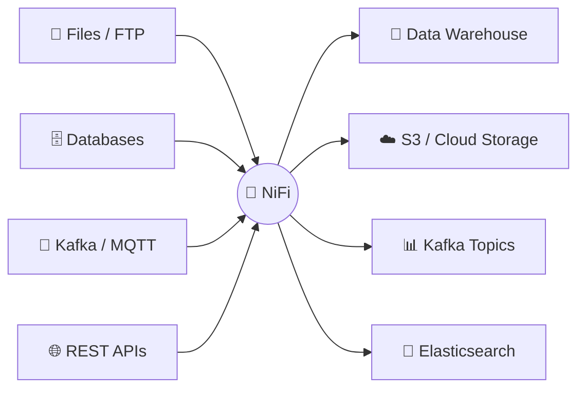
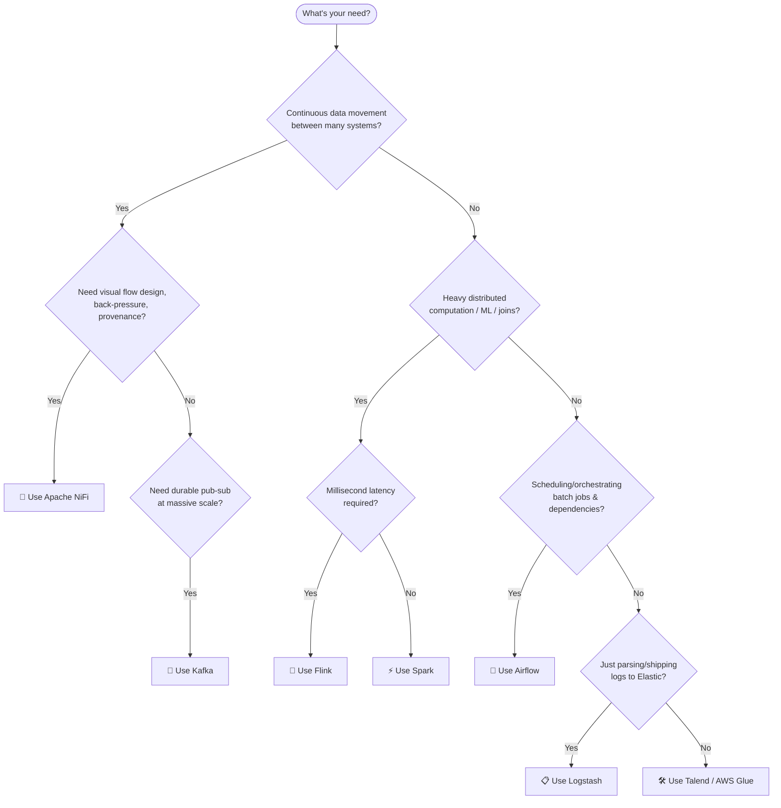
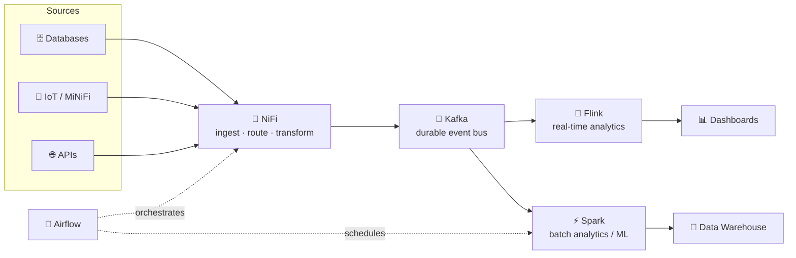

# 🔀 Apache NiFi vs Other Big Data Tools

A practical guide to understanding **what Apache NiFi is best at**, how it stacks up against
other popular data/big-data tools, and **when to reach for it (or something else)**.

---

## 1. 🧭 What is Apache NiFi, really?

Apache NiFi is a **data flow / data integration** engine. Its core strength is moving,
routing, transforming, and mediating data between systems — visually, reliably, and with
full data provenance (audit trail of every record).

> Think of NiFi as **"the plumbing"** — pipes, valves, and routing between systems — rather
> than a "compute engine" for heavy analytics or distributed batch processing.

---

## 2. 🆚 Quick Comparison Matrix

| Tool | 🎯 Primary Purpose | 🖥️ Interface | ⚙️ Processing Model | 📈 Scalability | 🧠 Learning Curve | 💾 Best Data Type |
|---|---|---|---|---|---|---|
| **🔀 Apache NiFi** | Data flow / routing / ingestion | Visual drag-and-drop UI | Flow-based, near real-time | Horizontal (NiFi cluster) | ⭐⭐ Low–Medium | Any (files, streams, events) |
| **📨 Apache Kafka** | Distributed messaging / event streaming | CLI / config + Connect API | Pub-sub log, real-time | Very high (partition-based) | ⭐⭐⭐ Medium | Event streams |
| **⚡ Apache Spark** | Distributed batch & micro-batch compute | Code (Scala/Python/SQL) | In-memory batch/streaming | Very high | ⭐⭐⭐⭐ High | Large-scale structured/unstructured |
| **🌊 Apache Flink** | True real-time stream processing | Code (Java/Scala/SQL) | Event-at-a-time streaming | Very high | ⭐⭐⭐⭐ High | Low-latency streams |
| **📅 Apache Airflow** | Workflow / job orchestration & scheduling | Code (Python DAGs) + UI | Batch scheduling (DAG) | High | ⭐⭐⭐ Medium | Task/job orchestration |
| **📋 Logstash (ELK)** | Log ingestion & parsing | Config file (DSL) | Streaming pipeline | Medium | ⭐⭐ Low–Medium | Logs / semi-structured text |
| **🧩 StreamSets** | Data flow (NiFi alternative) | Visual UI | Flow-based | High | ⭐⭐ Low–Medium | Any |
| **🛠️ Talend / AWS Glue** | ETL for analytics & warehousing | Visual UI / low-code | Batch ETL | High (managed) | ⭐⭐ Low–Medium | Structured/tabular data |

---

## 3. 🔍 NiFi vs Key Competitors (Head-to-Head)

### 🔀 NiFi vs 📨 Kafka
| Aspect | NiFi | Kafka |
|---|---|---|
| Role | Moves & transforms data **between** systems | **Transports** and stores event streams |
| Data at rest | Content stored on disk during flow (provenance) | Log-based durable storage (topics) |
| Together? | ✅ **Frequently paired**: NiFi ingests/routes → publishes to Kafka topics → consumers process | — |

> 💡 **Rule of thumb:** Kafka is the **highway**, NiFi is the **on/off ramps and traffic control**.

### 🔀 NiFi vs ⚡ Spark / 🌊 Flink
| Aspect | NiFi | Spark / Flink |
|---|---|---|
| Purpose | Route, transform, enrich data flow | Heavy distributed **computation** (joins, ML, aggregations) |
| Transformation complexity | Light–medium (filter, convert format, enrich) | Complex analytics, large-scale joins, ML pipelines |
| Latency | Near real-time (sub-second to seconds) | Spark: seconds–minutes (micro-batch) · Flink: milliseconds (true streaming) |
| Together? | ✅ NiFi lands/cleans raw data → hands off to Spark/Flink for heavy analytics | — |

### 🔀 NiFi vs 📅 Airflow
| Aspect | NiFi | Airflow |
|---|---|---|
| Purpose | **Continuous** data movement (streaming/event-driven) | **Scheduled** batch job orchestration (DAGs, cron-like) |
| Granularity | Record/flowfile level | Task/job level |
| Together? | ✅ Airflow can *trigger* NiFi flows or orchestrate around them | — |

### 🔀 NiFi vs 📋 Logstash
| Aspect | NiFi | Logstash |
|---|---|---|
| Scope | General-purpose data routing (any source/sink, 300+ processors) | Purpose-built for **log** ingestion into Elastic stack |
| Flexibility | Very high (visual, branching, back-pressure, provenance) | Narrower, but simpler for pure log pipelines |

### 🔀 NiFi vs 🧩 StreamSets / 🛠️ Talend / AWS Glue
These are the tools **most similar in purpose** to NiFi (visual, low-code data flow/ETL).
Choice often comes down to **licensing, cloud-vendor lock-in, and ecosystem**:
- **StreamSets** → similar architecture to NiFi, stronger drift-handling for schema changes.
- **Talend** → stronger enterprise ETL/data-quality tooling, commercial licensing.
- **AWS Glue** → best if you're **all-in on AWS** and want a managed/serverless experience.

---

## 4. 🗺️ When to Use What — Decision Guide

---

## 5. ✅ When Apache NiFi Is the Efficient Choice

| Scenario | Why NiFi Fits |
|---|---|
| 🏭 **IoT / edge data ingestion** | MiNiFi (lightweight agent) + back-pressure handling for unreliable networks |
| 🔗 **Integrating many heterogeneous systems** (DBs, APIs, files, queues) | 300+ prebuilt processors, no custom code needed |
| 🕵️ **Compliance-heavy environments** | Full data **provenance** — every record's lineage is tracked |
| 🎛️ **Non-developers need to build/monitor pipelines** | Visual drag-and-drop UI, live flow monitoring |
| 🔄 **Format conversion & light enrichment on the fly** (CSV→JSON, routing by content) | Purpose-built processors for this exact job |
| ⏸️ **Systems with unpredictable load** | Built-in back-pressure & prioritization queues |

## 6. ❌ When NOT to Use NiFi

| Scenario | Better Alternative |
|---|---|
| 🧮 Complex distributed joins, aggregations, ML training | ⚡ Spark |
| ⏱️ Millisecond-level stream analytics (windowing, CEP) | 🌊 Flink |
| 📬 Need a durable, replayable message backbone at huge scale | 📨 Kafka |
| 🗓️ Scheduling dependent batch jobs (daily reports, DAGs) | 📅 Airflow |
| 📜 Pure log shipping into an existing ELK stack | 📋 Logstash / Beats |

---

## 7. 🧩 Typical Combined Architecture (Real-World Pattern)

**Legend:**
- 🔀 NiFi = entry point / traffic control
- 📨 Kafka = durable backbone
- 🌊 Flink / ⚡ Spark = the "brains" doing computation
- 📅 Airflow = the "conductor" scheduling batch pieces

---

## 8. 📝 TL;DR Cheat Sheet

| If you need to... | Reach for... |
|---|---|
| Move data reliably between many systems, visually | 🔀 **NiFi** |
| Stream millions of events durably | 📨 **Kafka** |
| Crunch huge datasets / ML | ⚡ **Spark** |
| React to events in milliseconds | 🌊 **Flink** |
| Schedule & orchestrate batch workflows | 📅 **Airflow** |
| Ship logs to Elastic | 📋 **Logstash** |
| Low-code ETL fully managed on AWS | 🛠️ **AWS Glue** |

> 🏆 **Bottom line:** NiFi shines as the **ingestion and routing layer** at the edge of your
> data ecosystem — pair it with Kafka/Spark/Flink for the heavy lifting further downstream.
