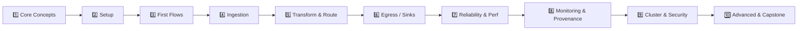

# 🗺️ Apache NiFi Roadmap — Practical Learning Path for Data Engineers

A hands-on, project-driven roadmap to go from **zero to production-ready** with Apache NiFi.
Each section lists **what to learn**, **key processors/concepts**, and a **practical exercise**
so you build real flows instead of just reading theory.

---

## 1️⃣ Core Concepts & Architecture

> **Goal:** Understand NiFi's mental model before touching the UI.

| Topic | Details |
|---|---|
| 🧩 FlowFile | Content + attributes — the unit of data moving through NiFi |
| ⚙️ Processor | The building block that acts on a FlowFile (300+ available) |
| 🔗 Connection & Queue | Links processors; holds FlowFiles with back-pressure limits |
| 📦 Process Group | Container for organizing/nesting flows |
| 🔌 Controller Service | Shared, reusable config (DB pools, SSL contexts, record readers) |
| 🎛️ Reporting Task | Background task for metrics/monitoring |
| 🧵 FlowFile Repository, Content Repository, Provenance Repository | Where NiFi persists state — know the difference |

**✅ Practical exercise:** Draw (on paper or Excalidraw) the path of one FlowFile from a `GenerateFlowFile` processor through 2 connections into a queue — label each repository involved.

---

## 2️⃣ Installation & Environment Setup

> **Goal:** Get a working NiFi instance you can experiment in safely.

| Topic | Details |
|---|---|
| 💻 Standalone install | Download & run NiFi locally (Java 11/17 required) |
| 🐳 Docker | `apache/nifi` image — fastest way to spin up/tear down |
| 🖥️ NiFi UI tour | Canvas, components toolbar, operate palette, status bar |
| ⚙️ `nifi.properties` basics | Ports, repositories, security-relevant configs |
| 📋 NiFi Registry (intro) | Version control for flows (deep dive in Section 9) |

**✅ Practical exercise:** Run NiFi via Docker Compose, log into the UI (`https://localhost:8443/nifi`), and change one property in `nifi.properties` (e.g., HTTP port) to confirm you can control the runtime.

---

## 3️⃣ Building Your First Flows (UI Fundamentals)

> **Goal:** Get comfortable with drag-and-drop flow building.

| Topic | Key Processors |
|---|---|
| Generating test data | `GenerateFlowFile` |
| Reading/writing local files | `GetFile`, `ListFile` + `FetchFile`, `PutFile` |
| Inspecting data | `LogAttribute`, viewing FlowFile content in the UI |
| Basic attribute manipulation | `UpdateAttribute` |
| Connections & relationships | success/failure relationships, auto-terminate vs route |

**✅ Practical exercise:** Build a flow that generates a file every 10s, adds a custom attribute (`env=dev`), and writes it to a local folder. Confirm it in the **Data Provenance** view.

---

## 4️⃣ Data Ingestion (Sources)

> **Goal:** Pull data from every common source type a data engineer encounters.

| Source Type | Processors |
|---|---|
| 📁 Filesystem / SFTP | `ListFile`/`FetchFile`, `ListSFTP`/`FetchSFTP`, `GetFTP` |
| 🗄️ Relational DB | `QueryDatabaseTable`, `GenerateTableFetch`, `ExecuteSQL` |
| 📡 Kafka / Messaging | `ConsumeKafka`, `ConsumeJMS`, `ConsumeMQTT` |
| 🌐 REST APIs | `InvokeHTTP`, `ListenHTTP` |
| ☁️ Cloud storage | `ListS3`/`FetchS3Object`, `ListAzureBlobStorage` |
| 🪟 Change Data Capture | `CaptureChangeMySQL`, `QueryDatabaseTable` incremental strategy |

**✅ Practical exercise:** Ingest rows incrementally from a Postgres/MySQL table using `QueryDatabaseTable` (maximum-value column strategy) and confirm only new rows flow on each run.

---

## 5️⃣ Data Transformation & Routing

> **Goal:** Learn NiFi's real value-add — shaping and directing data without custom code.

| Topic | Key Processors |
|---|---|
| Content-based routing | `RouteOnAttribute`, `RouteOnContent` |
| Record-oriented processing | `ConvertRecord`, Record Readers/Writers (CSV, JSON, Avro, Parquet) |
| JSON transformation | `JoltTransformJSON`, `JoltTransformRecord` |
| Schema management | `AvroSchemaRegistry`, NiFi's schema-inference features |
| Splitting/merging | `SplitRecord`/`SplitJson`, `MergeContent`/`MergeRecord` |
| Enrichment / lookups | `LookupRecord`, `LookupAttribute` + a lookup service (Simple/DB/Redis) |
| Custom logic | `ExecuteScript` (Groovy/Python/Jython), `ExecuteStreamCommand` |

**✅ Practical exercise:** Take incoming CSV data → convert to JSON via `ConvertRecord` → apply a `JoltTransformJSON` spec to rename/restructure fields → route bad records (schema mismatch) to a separate "quarantine" queue.

---

## 6️⃣ Data Egress (Sinks & Delivery)

> **Goal:** Land transformed data reliably into downstream systems.

| Destination | Processors |
|---|---|
| 🗄️ Relational DB | `PutDatabaseRecord`, `PutSQL` |
| 📨 Kafka | `PublishKafka` (Record variant preferred) |
| ☁️ Object storage | `PutS3Object`, `PutAzureBlobStorage` |
| 🔎 Search / analytics | `PutElasticsearchRecord` |
| 📁 Filesystem | `PutFile`, `PutSFTP` |
| ✅ Exactly-once/idempotency considerations | Transactional writes, dedup strategies |

**✅ Practical exercise:** Extend the Section 5 flow to write clean records into a Postgres table via `PutDatabaseRecord`, and publish the same records as Avro to a Kafka topic via `PublishKafka`.

---

## 7️⃣ Flow Control, Reliability & Performance

> **Goal:** Make flows production-grade, not just "it works on my machine."

| Topic | Details |
|---|---|
| ⏸️ Back-pressure | Object/size thresholds on connections |
| 🔢 Prioritizers | FIFO, Oldest-First, Newest-First, Priority Attribute |
| ⏰ FlowFile expiration | Auto-drop stale data in queues |
| 🧵 Concurrent tasks & scheduling | Timer-driven vs cron-driven, concurrent task tuning |
| ⚖️ Load balancing | Round-robin/partition-by-attribute across a cluster |
| 🔁 Retry & error handling patterns | Penalize, retry loops, dead-letter queues |
| 🧪 Backpressure testing | Simulate slow downstream, observe queue behavior |

**✅ Practical exercise:** Configure back-pressure (e.g., 1,000 objects) on a queue feeding a deliberately slow `PutDatabaseRecord`, add a retry loop for failures, and route repeated failures to a dead-letter `PutFile` sink.

---

## 8️⃣ Monitoring, Provenance & Troubleshooting

> **Goal:** Know what happened to every record, and diagnose issues fast.

| Topic | Details |
|---|---|
| 🕵️ Data Provenance | Search/replay/lineage graph for any FlowFile |
| 📊 Status history & summary | Per-processor throughput, bytes in/out, GC/heap stats |
| 🔔 Bulletins | Warning/error indicators on processors |
| 📈 Reporting Tasks | Push metrics to Prometheus, Ambari, Graphite |
| 🪵 Logs | `nifi-app.log`, `nifi-bootstrap.log` — what lives where |
| 🧯 Common failure patterns | OOM from large content, stuck queues, misconfigured schedulers |

**✅ Practical exercise:** Intentionally break a flow (bad DB credentials), find the bulletin, trace the failed FlowFile in Data Provenance, and replay it after fixing the issue.

---

## 9️⃣ Clustering, Security & Governance

> **Goal:** Operate NiFi the way it runs in real organizations.

| Topic | Details |
|---|---|
| 🖧 Clustering | Zero-master clustering, Cluster Coordinator, Primary Node |
| 🔐 Security | TLS/SSL setup, user authentication (LDAP/OIDC/Kerberos) |
| 🛡️ Authorization | Policies, multi-tenant access control |
| 📋 NiFi Registry | Versioning flows, promoting dev → staging → prod |
| 🧾 Parameter Contexts | Externalizing environment-specific config (replaces old Variable Registry) |
| 📜 Governance | Flow documentation, naming conventions, change approval |

**✅ Practical exercise:** Stand up a 3-node NiFi cluster (Docker Compose), version a flow in NiFi Registry, and promote it between two environments using Parameter Contexts for connection strings.

---

## 🔟 Advanced Topics & Capstone Project

> **Goal:** Tie everything together and go beyond the basics.

| Topic | Details |
|---|---|
| 🪶 MiNiFi | Lightweight NiFi agent for edge/IoT data collection |
| 🧑‍💻 Custom processor development | Writing Java/Python processors when built-ins aren't enough |
| 🔄 CI/CD for NiFi flows | Automating flow deployment via NiFi Registry + REST API |
| 🔗 Ecosystem integration | Pairing NiFi with Kafka, Spark/Flink, Airflow (see [Compare.md](Compare.md)) |
| 📐 Design patterns | Idempotent flows, schema evolution handling, multi-tenant process groups |

**🏆 Capstone project:** Build an end-to-end pipeline:
`REST API + DB CDC → NiFi (validate, transform, route bad records) → Kafka → S3/Data Warehouse`,
clustered, versioned in NiFi Registry, secured with TLS, and monitored with a reporting task
pushing metrics to Prometheus/Grafana.

---

## 📚 Suggested Pace

| Weeks | Sections |
|---|---|
| Week 1 | 1️⃣–3️⃣ (concepts, setup, first flows) |
| Week 2 | 4️⃣–5️⃣ (ingestion, transformation) |
| Week 3 | 6️⃣–7️⃣ (egress, reliability/performance) |
| Week 4 | 8️⃣–9️⃣ (monitoring, clustering/security) |
| Week 5+ | 🔟 (advanced topics + capstone) |

> 💡 **Tip:** Keep every exercise's flow exported as a template/versioned in NiFi Registry —
> by the end you'll have a personal library of reusable flow patterns.
